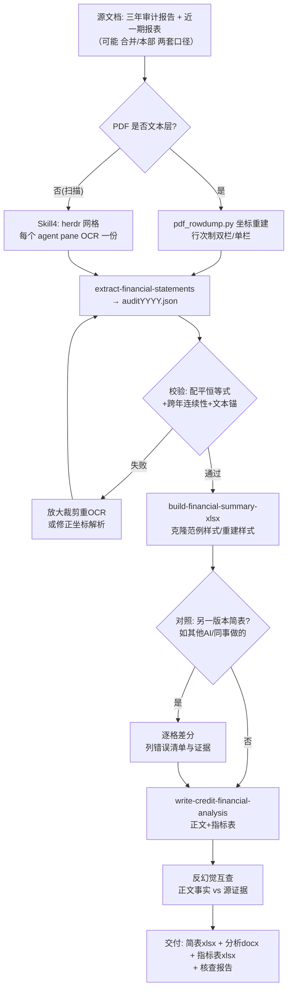

# credit-financial-summary-skills

银行授信/信贷审查场景下的「**近三年一期财务简表 + 财务分析**」全套可复用技能（Claude Skills / Agent Skills）。

> 由一次真实的银行授信审查案例提炼：以企业「合并 / 本部（母公司单体）」两套口径、近三年审计报告 + 近一期报表（“三年一期”）为输入，产出：
> ① 三张报表的结构化 JSON（可追溯、可配平）
> ② 与行内既有范例**完全同构**的「近三年及近期财务数据简表.xlsx」
> ③ 与《授信调查报告》体例一致的财务分析正文 + 财务指标分析表
> ④ 与他人（其他 AI/同事）版本的**反幻觉互查**

---

## 目录

- [一、为什么需要这套技能](#一为什么需要这套技能)
- [二、仓库结构](#二仓库结构)
- [三、五个 Skill 总览、分工与业务品种明确区隔](#三五个-skill-总览分工与业务品种明确区隔)
- [四、端到端工作流（含 Mermaid 流程图）](#四端到端工作流含-mermaid-流程图)
- [五、安装与使用](#五安装与使用)
  - [5.1 安装为 Claude Code Skills](#51-安装为-claude-code-skills)
  - [5.2 安装为通用 Agent Skills（agentskills.io）](#52-安装为通用-agent-skillsagentskillsio)
  - [5.3 手工拷贝（不使用任何安装器）](#53-手工拷贝不使用任何安装器)
- [六、核心方法论（务必先读）](#六核心方法论务必先读)
  - [6.1 证据链与反幻觉](#61-证据链与反幻觉)
  - [6.2 输入分类：文本层 PDF vs 扫描 PDF](#62-输入分类文本层-pdf-vs-扫描-pdf)
  - [6.3 数值与格式约定（银行简表口径）](#63-数值与格式约定银行简表口径)
  - [6.4 变化率（变化率）的符号与精度约定](#64-变化率变化的符号与精度约定)
  - [6.5 指标口径（财务指标分析表）](#65-指标口径财务指标分析表)
  - [6.6 话术软化原则（避免负面评价）](#66-话术软化原则避免负面评价)
  - [6.7 并行协作模式（herdr 多 agent）](#67-并行协作模式herdr-多-agent)
- [七、各 Skill 输入输出速查](#七各-skill-输入输出速查)
- [八、典型坑与规避（来自实战）](#八典型坑与规避来自实战)
- [九、验证清单（交付前逐项打勾）](#九验证清单交付前逐项打勾)
- [十、FAQ](#十faq)
- [十一、许可证与免责声明](#十一许可证与免责声明)
- [十二、版本历史](#十二版本历史)

---

## 一、为什么需要这套技能

银行对公授信调查中，“近三年及近期财务数据简表”几乎是每一户授信申报的标配底稿，由**审计报告/财务报表**人工摘数制作。实际工作中大量审计报告是**扫描件（无文字层）**、版本体例各不相同（新准则 vs 银行简式会企表）、且常常需要**合并口径 + 本部单体口径**各做一套。人工摘数慢且错位高发（实战中不同人/不同 AI 做出的版本在“应付票据/应付账款/预收账款”等科目整行错位）。

本仓库把「一次跑通的正确做法」沉淀为 5 个可组合的专业 Skill：

1. 不管 PDF 是文本层还是纯扫描，都能稳定地把**三张报表全行项目**提成 JSON；
2. 用**报表自身恒等式 + 跨年连续性 + 文本锚点**做三重校验，把 OCR 误差压到可交付水平；
3. 按行内范例 **1:1 复刻样式**生成简表 xlsx（克隆或重建两种模式），并自动按统一约定计算变化率；
4. 产出**合规、软化负面、可追溯**的财务分析正文与指标表，并内置与他人版本**互查反幻觉**的流程。

---

## 二、仓库结构

```
credit-financial-summary-skills/
├── README.md                        # 本文件（总览 + 安装 + 方法论）
├── LICENSE                          # MIT
├── docs/
│   ├── WORKFLOW.md                  # 端到端流程 + 目录/命名约定 + 证据链设计
│   └── TERMINOLOGY.md               # 术语与口径：合并/本部、三年一期、审计 vs 简式表、科目别名
└── skills/                          # 每个子目录是一个可独立安装的 Skill
    ├── extract-financial-statements/
    │   ├── SKILL.md                 # Skill 1：报表 → 结构化 JSON
    │   └── scripts/
    │       ├── ocr_page.py          # 扫描 PDF 逐页 OCR（含几何框）→ JSON
    │       ├── ocr_crop.py          # 局部放大重 OCR（解决水印/错读单元格）
    │       ├── pdf_rowdump.py       # 文本 PDF 按行/列坐标 dump（处理双栏行次制报表）
    │       └── validate_extraction.py # 配平恒等式 + 跨年连续性校验
    ├── build-financial-summary-xlsx/
    │   ├── SKILL.md                 # Skill 2：多年 JSON → 简表 xlsx（克隆/重建）
    │   └── scripts/
    │       ├── row_defs.py          # 标准 51 行简表科目映射表（含别名/聚合行）
    │       ├── build_summary_xlsx.py# 重建模式（无模板时按样式快照从零建表）
    │       └── verify_summary_xlsx.py # 逐格独立复算比对（306 格 0 差异目标）
    ├── write-credit-financial-analysis/
    │   ├── SKILL.md                 # Skill 3：财务分析正文 + 指标表 + 反幻觉
    │   └── scripts/
    │       ├── indicator_table.py   # 指标表 xlsx（含全部口径注）
    │       ├── analysis_docx.py     # 仿宋排版 docx 骨架生成
    │       └── anti_hallucination.md# 反幻觉互查清单模板
    └── herdr-parallel-ocr-team/
        ├── SKILL.md                 # Skill 4：herdr 多 agent 并行 OCR 协作
        └── scripts/
            ├── grid_and_start.md    # pane 网格 + agent 启动命令速查（带真实示例）
            └── sample_prompts.md    # 每个 pane agent 的任务 prompt 模板
```

> 说明：各 Skill 的 `SKILL.md` 是给 AI Agent 读的“使用说明书”；`scripts/` 是给 Agent 调用/参考的实现（命令行通用化，不含任何绝对路径）。运行时请按 `docs/WORKFLOW.md` 的目录约定组织你的项目目录。

---

## 三、五个 Skill 总览、分工与业务品种明确区隔


### 💡 授信业务品种明确区隔矩阵（务必按品种调用对应 Skill）

在银行信贷与风控审查实操中，不同信贷业务品种的审查要求、调查深度与报告格式具有本质区别，本套件进行了严格的专业分工：

| 授信业务品种 / 场景 | 核心特征与适用主体 | 对应 Sub-Skill | 产出成果与标准体例 |
| :--- | :--- | :--- | :--- |
| **小微客户一般授信业务**<br>*(普惠金融专项)* | • 授信金额一般在 **1000万元以内**（最高不超过3000万）<br>• 授信主体为小微企业法人或实际控制人个人<br>• 常见产品：小企业流动资金信用贷、抵押贷、无还本续贷、科创贷等<br>• 审查重点：实控人资产负债、人行征信无不良、银监会营运资金需求量测算、11张结构化审批表格 | **`write-micro-credit-report`**<br>*(专属全新 Skill)* | 输出完整的《小微客户一般授信业务调查报告.docx》（1:1同构11张标准表格），含银监会流贷测算与还款来源分析 |
| **全口径三年一期财务分析**<br>*(财务专项切片)* | • 针对任何规模企业（小微或大中型）的三年一期财务专项深度剖析<br>• 审查重点：重点科目±30%展开、话术软化、防负面断崖词汇、财务指标分析表生成 | **`write-credit-financial-analysis`** | 输出《财务分析正文.docx》+《财务指标分析表.xlsx》，作为独立底稿或并入授信报告第三章节 |
| **财务报表自动化提取**<br>*(跨表平衡自证)* | • 审计报告、电子税务局申报表 PDF（文本层或纯扫描件）<br>• 资产负债表、利润表、现金流量表全行项目结构化提取 | **`extract-financial-statements`** | 输出配平自证的 `auditYYYY.json`，支持双栏与跨年连续性校验 |
| **近三年财务数据简表生成**<br>*(银行51行底稿)* | • 将多年财报 JSON 汇总为银行 51 行人行口径数据简表<br>• 1:1 克隆或重建银行特定样式、千分位、'-'零值与变化率 | **`build-financial-summary-xlsx`** | 输出与行内既有模板完全同构的《近三年及近期财务数据简表.xlsx》 |
| **多 Agent 并行 OCR 协作**<br>*(多年度并行处理)* | • 针对 3~4 个年度同时存在大体量扫描件审计报告场景<br>• 在 herdr 终端多路复用器中分派子 Agent 并行作业 | **`herdr-parallel-ocr-team`** | 多 Agent 并行加速提取与交叉校验，主 Agent 负责契约终检 |

| Skill | 输入 | 输出 | 依赖 |
| --- | --- | --- | --- |
| `extract-financial-statements` | 审计报告/财务报表 PDF（文本层或扫描）+ 提取需求（年度、口径：期末/期初…） | 每份年报一个 JSON：`bs/is/cf` 全行项目 + `current/opening(prior)` 双栏 + 页码 + notes | Python 3.10+、pymupdf、rapidocr-onnxruntime（扫描件）；anydoc 可选 |
| `build-financial-summary-xlsx` | 多年 JSON（年份对齐）+ 行内范例简表 xlsx 或 CSV（若存在） | 「近三年及近期财务数据简表.xlsx」（2023/2024/变化率/2025/变化率/近一期 六数据列 × 51 指标行） | openpyxl |
| `write-credit-financial-analysis` | 简表数值/JSON + 《授信调查报告》体例样本（可选）+ 附注 OCR（可选） | 财务分析 docx（正文）+ 财务指标分析表.xlsx + 反幻觉核查报告 | python-docx、openpyxl |
| `herdr-parallel-ocr-team` | 多份扫描 PDF（每份一个 agent pane） | 并行完成的 `_extract/auditYYYY.json` + 摘要 | herdr CLI（`HERDR_ENV=1` 环境） |

---

## 四、端到端工作流（含 Mermaid 流程图）



### 目录与命名约定（强烈建议照做）

```
<项目根>/
├── 合并三年一期报告/            # 合并口径源文档（或：本部三年一期报告/）
├── 合并财务数据简表.xlsx        # 范例（若存在，用于克隆样式/互查）
├── 本部三年一期报告/            # 本部（母公司单体）口径源文档
├── 本部三年一期报告/_md/        # 文本 PDF 预转 markdown（占位排查用）
├── 本部三年一期报告/_extract/   # 中间产物：
│   ├── EXTRACTION_SPEC.md       # 提取规范（发给各 OCR agent 的共享契约）
│   ├── ocr_page.py / ocr_crop.py
│   ├── audit2023.json … audit2606.json   # 逐年三表 JSON
│   ├── notes2023.json …         # 附注关键信息 OCR（账龄/折旧/明细等）
│   └── 校验/构建脚本
├── 本部财务数据简表.xlsx        # 最终交付 1
├── 本部单体财务分析.docx        # 最终交付 2
└── 本部财务指标分析表.xlsx      # 最终交付 3
```

---

## 五、安装与使用

### 5.1 安装为 Claude Code Skills

Claude Code 通过 `~/.claude/skills/<skill-name>/SKILL.md`（全局）或项目内 `.claude/skills/<skill-name>/SKILL.md`（仅本项目）发现技能：

```bash
# 方式 A：直接用 Claude Code 的 skill-install（在支持的环境中）
# 在对话中提供本仓库 GitHub 地址即可；或
# 方式 B：手工放置（以本项目 build-financial-summary-xlsx 为例）
mkdir -p ~/.claude/skills
cp -r skills/* ~/.claude/skills/
# 之后在新会话中提问“做近三年一期财务简表”即可自动触发
```

> 不需要全部安装：按任务只拷贝对应 Skill（含其 `scripts/` 子目录）即可。若放在项目内，请确保把 `.claude/skills` 加入你的代码库。

### 5.2 安装为通用 Agent Skills（agentskills.io）

仓库根目录 `skills/` 采用 agentskills 兼容布局，一个仓库含多个技能：

```bash
# 一次性安装本仓库全部 4 个技能
npx skills add <owner>/credit-financial-summary-skills
# 或按需安装某个技能（多数 Agent Skill 工具支持 skills/<name> 路径）
```

### 5.3 手工拷贝（不使用任何安装器）

任何 AI 工具（Claude Code / Codex / Cursor / OpenCode 等）都支持“把目录作为技能/规则”：

1. 把 `skills/<需要的技能>/` 整个目录放入你的技能目录；
2. 在系统提示或会话开始处引用 `SKILL.md`；
3. 将 `scripts/` 里的 Python 脚本按 `docs/WORKFLOW.md` 复制到项目 `_extract/` 下使用。

### 运行时依赖（一次装好）

```bash
pip install pymupdf rapidocr-onnxruntime openpyxl python-docx
# 可选：anydoc（文本 PDF → markdown 快速预览）
npm i -g @firecrawl/anydoc        # 或 npx @firecrawl/anydoc
```

---

## 六、核心方法论（务必先读）

### 6.1 证据链与反幻觉

**原则：任何进入交付文档的数字都必须能追溯到源文件的一行/一页，且通过至少一种独立关系自证。**

1. **报表自身配平恒等式**（金额允许 ≤0.5 元舍入差）：
   - BS：`资产总计 = 流动资产合计 + 非流动资产合计`；`负债合计 = 流动负债合计 + 非流动负债合计`；`资产总计 = 负债合计 + 所有者权益合计`；
   - IS：`营业利润 = 营业收入 − 营业成本 − 税金及附加 − 销售/管理/研发/财务费用 + 其他收益 + 投资收益 + 公允价值变动 + 信用/资产减值损失 + 资产处置收益`；`利润总额 = 营业利润 + 营业外收入 − 营业外支出`；`净利润 = 利润总额 − 所得税费用`；
   - CF：`现金及现金等价物净增加额 = 经营 + 投资 + 筹资活动净流量 + 汇率影响`；`期末现金 = 期初现金 + 净增加额`。
2. **跨年连续性**：`审计2023期末 = 审计2024期初`、`审计2024期末 = 审计2025期初`。两份报表由**独立 OCR 通道**读出仍能对齐，是捕捉单页 OCR 错位的最强校验（实战用它抓出了“应付账款整行错位”）。
3. **文本锚点**：当某期同时存在文本层报表（如银行 2606 简式表）时，其“年初余额”列应与上一审计年末精确相等——用文本层反向锚定扫描件数字。
4. **差异必须可解释**：连续性比对出现差异时逐条归因（命名变体“预收账款 vs 预收款项”、列示口径差异“应付利息并入其他应付款”），**严禁凑数掩盖**。

### 6.2 输入分类：文本层 PDF vs 扫描 PDF

- **文本层 PDF**：先 `anydoc in.pdf -o out.md` 快速预览；若版式是“双栏行次制简式报表”（资产/负债左右分栏、行次 1..61），anydoc 会压平错位，**必须用 `pdf_rowdump.py` 按 (x,y) 坐标重建**（关键词：x<270 资产侧 / x≥270 负债侧；金额列按 x 升序 = 期末列→年初列；行次为 1..61 的小整数 token）。
- **扫描 PDF**：`anydoc` 报 `NeedsOcr` 后走 rapidocr 管线（`ocr_page.py` 全页 300dpi → `ocr_crop.py` 对可疑单元格 500dpi 裁剪放大重 OCR）。
- 先把“哪几页是报表页”定位出来再全量 OCR（本案例审计报告第 6-8 页为报表，附注 21-29 页为极简版）。

### 6.3 数值与格式约定（银行简表口径）

| 事项 | 约定 |
| --- | --- |
| 单位 | 源表以“元”列示 → 简表统一 **万元 = round(元 ÷ 10⁴, 2)** |
| 零值/科目缺失 | 显示 **`-`**（不是 0） |
| 金额数字格式 | 仿范例：`|x| ≥ 1000` 用 `#,##0.00`，否则 `General`（多数范例如此，需先观察范例） |
| 变化率列 | 数值存 `(后−前)/|前|` round 4，单元格格式 `0.00%` |
| 表头“近一期”列 | 用文本“2026年6月”或日期格式 `yyyy"年"m"月"`，与范例保持一致 |
| 字体 | 仿宋（标题 14 加粗，表头/数据 10），标题/单位行居中 |
| 行高/列宽 | 从范例 dump（openpyxl row_dimensions/column_dimensions）逐行照搬，B 列换行靠行高容纳 |

科目映射要点（见 `build-financial-summary-xlsx/scripts/row_defs.py`）：
- 简表模板行（51 行）与源报表科目名存在变体：`应收帐款/应收账款`、`预付账款/预付款项`、`预收账款/预收款项/合同负债`、`实收资本（或股本）/股本`等 → **候选前缀列表**匹配；
- 科目 key 可能带“一、/减：/加：/其中：”等前缀 → 匹配前剥离；
- 聚合行：`长期投资` = `长期股权投资+可供出售金融资产+持有至到期投资+债权投资+其他债权投资+其他权益工具投资+其他非流动金融资产+长期应收款`；
- 两套口径并存时：**合并口径取合并报表列，本部口径取母公司报表列**，绝不可混。

### 6.4 变化率（变化率）的符号与精度约定

- 范例（行内已定稿简表）实际采用 **`(后 − 前) / |前|`**（对负基数行也按“变动方向”定号），不是教科书 `后/前 − 1`（后者在基数为负时符号相反——实战 7 个单元格因此全错）。
- 前为 0/缺、后 >0 → 记 `1`（显示 100.00%）；后 <0 → `-1`；前后皆 0/缺 → `-`。
- 精度：与范例多数单元格一致按“两位万元显示值”计算并 round 4；个别大倍数变化率在末位 ±0.0001 的差异通常来自未舍入原值，属不可裁定的精度噪声，不必强求复现。

### 6.5 指标口径（财务指标分析表）

| 指标 | 口径（统一，避免“不同年份用不同分母”） |
| --- | --- |
| 资产负债率 | 负债合计 / 资产总计 |
| 流动比率 / 速动比率 | 流动资产 / 流动负债；(流动资产−存货)/流动负债 |
| 利息保障倍数 | (利润总额+财务费用)/财务费用；**半年期不列**（仿范例） |
| 存货周转率 | 营业成本 / 平均存货（期初期末）；2026.6 为半年按 ×2 年化并标 `*` |
| 应收帐款周转率 | 营业收入 / 平均应收账款；半年 ×2 年化标 `*` |
| 总资产周转率 | 营业收入 / 平均总资产；半年 ×2 年化标 `*` |
| EBITDA | **先查附注是否披露折旧摊销**；极简附注未披露时按“利润总额+财务费用”列示并**加注口径**，严禁虚构折旧额 |
| 销售净利率 / ROE | 净利润/营业收入；净利润×年化系数/平均净资产 |
| 现金比率 | (货币资金+交易性金融资产)/流动负债（行内口径如此，须先核对范例） |
| 经营CF/总债务 | 经营活动净流量 / 负债合计 |
| 经营CF/短期债务 | 经营活动净流量 / (短期借款+应付票据) |
| 增长率 | 销售收入/净利润增长率、资本积累率：均为百分比数值 |

> 附注可用性预检：若审计附注是“各科目仅期末/期初单行”的**极简版**（本案例即如此），则**不要**写前五名客户、账龄分段、坏账率、折旧拆分等附注不披露的数字——这正是对方版本 EBITDA“虚构精度”的根源。

### 6.6 话术软化原则（避免负面评价）

授信报告要求正面、建设性、合规表达；数据若难看，不回避但**给原因 + 给对冲事实 + 弱化用词**：

| 避免（负面/耸动） | 建议（软化/中性+对冲） |
| --- | --- |
| 现金“骤降/跌至不足千万” | “账面资金有序收窄”“资金投向实体与偿还借款”“经营净现金流持续正流入、已超上年全年”“集团统筹安排，流动性保障尚可” |
| “资产负债率上升至…风险” | “负债主要为经营性无息负债”“杠杆处较低区间（24%–35%），优于行业与集团合并口径” |
| 净利“微薄” | “盈余留存于生产子公司（近年未实施分红，未分配利润变动≈净利润）”“随基地投产与分红机制建立，回报潜力将释放” |
| 预收/应收等大额波动“暴增” | “随购销规模自然增长”“账龄均 1 年以内（附注）”“反映订单饱满、回款前置” |
| 不确定归因 | 加“主要系…”“结合股权与组织架构判断”“（以人行征信为准）”等限定，**不写无源具体化**（如“资本公积转增”“未动用授信额度”） |

### 6.7 并行协作模式（herdr 多 agent）

详见 `skills/herdr-parallel-ocr-team/SKILL.md`。要点：
- 多份扫描件 → 每份一个 herdr pane agent 并行 OCR，**共享一份 EXTRACTION_SPEC.md 契约**，各自输出 `auditYYYY.json`；
- 文本层的那份由主 Agent 自己解析（不浪费 pane）；
- Main 负责契约与终检，agent 只做“读→提取→校验→写 JSON→回摘要”；
- agent 丢失/失败 → `herdr pane split` 新建 pane 重派（实战：audit2025 的 pane 被用户关闭后按此法恢复）。

---

## 七、各 Skill 输入输出速查

```bash
# Skill 1 示例（扫描 PDF，提取全部页 OCR；页码可逗号/区间）
python scripts/ocr_page.py <审计报告.pdf> --pages 1-33 --out ./ocr_out
python scripts/ocr_crop.py  <审计报告.pdf> --page 12 --crop x0,y0,x1,y1 --out cell.png
python scripts/pdf_rowdump.py <文本简式报表.pdf>            # 逐行坐标 dump
python scripts/validate_extraction.py --json audit2023.json audit2024.json audit2025.json audit2606.json

# Skill 2 示例
python scripts/build_summary_xlsx.py \
  --source "2023=audit2023.json" --source "2024=audit2024.json" \
  --source "2025=audit2025.json" --source "2606=audit2606.json" \
  --period-label "2026年6月" --out "本部财务数据简表.xlsx" \
  [--template 合并财务数据简表.xlsx]        # 提供模板→克隆样式；否则按样式快照重建
python scripts/verify_summary_xlsx.py --xlsx 本部财务数据简表.xlsx --json audit*.json

# Skill 3 示例
python scripts/indicator_table.py --json audit2023.json audit2024.json audit2025.json audit2606.json --out 本部财务指标分析表.xlsx
python scripts/analysis_docx.py  --out 本部单体财务分析.docx   # 依模板填正文（正文由 AI 按 SKILL 撰写）
```

各 JSON Schema 与恒等式详见对应 SKILL.md。

---

## 八、典型坑与规避（来自实战）

1. **双栏简式报表（行次制）用整页文本抽取 → 行数错位**：必须坐标重建（x 分侧、行次 token 定行、x 序定 期末/年初）。
2. **`金额列 x 排序 用数值而非 x`**：期末<年初的科目会整行对调（实战 bug：流动资产合计配不平即暴露）。
3. **变化率符号（负基数）**：见 6.4，务必用 `(后−前)/|前|`。
4. **OCR 把极小零值行读出几分钱噪声**（如营业外支出 0.0027 元）→ 显示 0/'-'，但按“元”算变化率会爆炸成 28 万%；**变化率统一用两位万元显示值计算**。
5. **科目 key 前缀**：`减：营业成本`、`五、现金及现金等价物净增加额` → 匹配前剥离罗马序号与 减/加/其中 前缀。
6. **他人版本的整行/整列错位**：互查时必须做“数值级 + 列名 + 期初/期末语义”三层核对；对方“应付票据=6,471.33、预收2026.6=242.52（实为应付职工薪酬）”等错误正源于行次错位 + 忽略跨年锚点。
7. **样式克隆的前提是模板还在**：范例 xlsx 若被另存为 CSV（常见）即失去字体/行高/格式——先用 openpyxl dump 样式快照，再“重建模式”恢复；或请用户恢复原文件。
8. **附注极简版**：先 OCR 附注 2–3 页确认披露粒度，再决定能写哪些明细（账龄/前五/折旧）。

---

## 九、验证清单（交付前逐项打勾）

- [ ] 每份 JSON：BS 配平、IS 链式、CF 链式全部 `OK`
- [ ] 跨年：2023末=2024初、2024末=2025初；差异全部可解释（命名/口径变体）
- [ ] 若存在文本层同期报表：其“年初”与上一审计年末逐科目一致（或已解释）
- [ ] 简表：行数/列结构与范例一致；数值 = round(元÷10⁴,2)；0/缺 → `-`；306 格独立复算 0 差异
- [ ] 变化率列符号/格式与范例抽查一致（负基数行重点）
- [ ] 指标表：口径注完整；半年列已标 `*`；EBITDA 无虚构折旧；利息保障半年列不硬填
- [ ] 正文：重点科目齐、±30% 大额变动已展开、负面话术已软化、无源具体化已删/加限定
- [ ] 反幻觉互查：对方每个可疑数字都有“事实 + 来源”裁定，已写入核查报告

---

## 十、FAQ

**Q1：只有合并审计报告，没有本部单体审计报告怎么办？**
简表只能基于可得口径；若范例模板存在，至少先交付已有口径的一版，并在正文注明口径与缺失，不虚构。部分审计报告内含“母公司”单列报表可自行拆出——先确认报表表头再取数。

**Q2：OCR 数字总有几个不确定怎么办？**
用恒等式定位到具体行/列后，对单格 500dpi 裁剪重 OCR；仍失败则该行进入 `notes.unresolved`，并保持整表其他行可交付。银行底稿以最终复核（见 6.1 三重证据）为准。

**Q3：怎么把“别人做好的简表”并入？**
先做全表数值差分（各自与源 JSON 复算），列“对方错误清单 + 我方/正确值 + 证据”，再由用户决定替换范围；不要把错值悄悄改对后直接覆盖（需留痕）。

**Q4：指标表里的“行业均值”哪里来？**
取行内授信报告模板常驻参考区间（如资产负债率 50–70%、流动 1.5–2.0 等）；不同银行不同，以你行模板为准。

**Q5：能直接用于港股/IPO 招股书吗？**
方法通用（招股书会计报告为文本层，坐标法更稳）；科目映射与简表模板需按监管/行内格式调整。

---

## 十一、许可证与免责声明

MIT License。本仓库技能与脚本仅用于**信息整理与文档编制辅助**；财务数据以企业经审计的正式报告为准，AI 产出的任何数字与结论在使用前必须由具备资质的人员复核。脚本不含任何客户敏感数据（示例数据已脱敏/聚合）。

## 十二、版本历史

- v1.0（2026-09）：初版，沉淀自银行授信“合并/本部三年一期”简表 + 财务分析实战案例。
