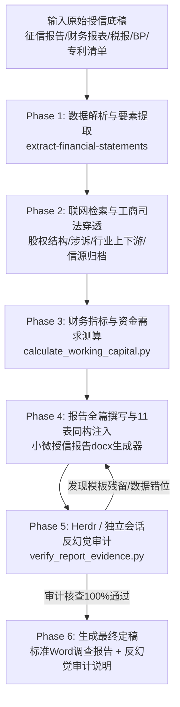

# 小微客户一般授信业务调查报告 — 标准化提示词与端到端 Workflow 规范

本文档为 AI Agent 全自动编制银行小微企业一般授信业务调查报告的权威操作手册与标准化提示词库。

---

## 阶段一：标准化 Prompt Templates（提示词模板）

### 提示词 1：【阶段 1 — 底层证据链结构化解析】
```markdown
【角色与定位】
你是一名资深银行信贷风控与调查报告撰写专家。请解析当前授信申请企业提供的全套底稿文件。

【输入底稿】
1. 中国人民银行《企业信用报告》（PDF）
2. 近三年一期财务报表及审计报告（PDF/JSON）
3. 电子税务局纳税申报表（一般纳税人增值税申报表、居民企业所得税年度纳税申报A100000主表）
4. 企业商业计划书（BP）、高管与行业设施资料、专利清单统计表
5. 参考标准模板（.docx）

【任务指令】
1. 提取申请人法定全称、统一社会信用代码、成立日期、注册资本与实收资本（元/万美元）；
2. 穿透股权架构至自然人实际控制人（姓名、证件类型及号码、出资比例）；
3. 梳理人行征信核心指标：发生信贷交易机构数、未结清与已结清笔数、五级分类状态（是否有关注或不良）、当前银行借款逐笔明细（银行、金额、期限、担保方式）；
4. 梳理主营产品、核心技术与专利总数、上下游核心客户及合作方式；
5. 提取近三年一期关键财务数据（总资产、流动资产、货币资金、应收账款、存货、负债总额、短期借款、所有者权益、营业收入、营业成本、研发费用、净利润）。

【反幻觉硬性约束】
- 凡在底稿中未明确记载的事项（如实控人配偶身份证号、家庭住宅房产明细、员工花名册确切人数等），一律登记为“留空待补充”，绝对严禁编造或推测任何虚假信息！
```

### 提示词 2：【阶段 2 — 财务分析与营运资金量精准测算】
```markdown
【测算任务】
依据银监会《流动资金贷款管理暂行办法》及银行小微授信标准，对企业财务数据进行指标计算与测算。

【测算规范】
1. 资产负债率 = 负债总额 / 资产总额
2. 流动比率 = 流动资产 / 流动负债；速动比率 = (流动资产 - 存货) / 流动负债
3. 销售利润率 = 利润总额 / 营业收入
4. 存货周转天数 = (平均存货 × 360) / 营业成本
5. 应收账款周转天数 = (平均应收账款 × 360) / 营业收入
6. 预付账款周转天数 = (平均预付款项 × 360) / 营业成本
7. 应付账款周转天数 = (平均应付账款 × 360) / 营业成本
8. 预收账款周转天数 = (平均预收账款/合同负债 × 360) / 营业收入
9. 营运资金周转天数 = 存货周转天数 + 应收账款周转天数 + 预付账款周转天数 - 应付账款周转天数 - 预收账款周转天数
10. 营运资金需求量 = 上年度销售收入 × (1 - 销售利润率) × (1 + 预计销售增长率) / 营运资金周转次数
11. 新增流动资金贷款需求额度 = 营运资金需求量 - 自有资金 - 现有流动资金贷款

【话术软化规范】
- 针对阶段性亏损或高研发投入企业，话术坚决避免使用“暴跌/巨亏/断崖/风险敞口过大”等负面词汇；
- 转为中性及建设性表达：“主要系企业加大前瞻性底层技术研发投入、引进领军人才及推进产线中试所致；随着主营订单逐步放量，毛利空间显著修复，亏损大幅收窄，经营效益处于强劲回升通道”。
```

### 提示词 3：【阶段 3 — 全套报告组装与 11 表同构生成】
```markdown
【文档生成指令】
请使用 python-docx 将整理好的内容注入银行《小微客户一般授信业务调查报告模板.docx》，生成完整的定稿 Word 文档。

【表格映射规范】
- Table 0: 申请人基本情况表（用款企业、申报1000万、实收资本、行业代码、经营范围）
- Table 1: 实际控制人基本信息表（钟博文台胞证00616363、家庭资产负债结构、征信无不良）
- Table 2: 法定代表人基本信息表（明确与实控人同一）
- Table 3: 关联企业情况表（全资子公司、外贸平台、生产协同工厂）
- Table 4: 涉诉案件及公共记录核查表（无执行、无行政处罚、零星商业纠纷已结案）
- Table 5: 经营情况综合分析大表（创立背景、主导产品无水染色技术突破、行业与双碳、上下游及竞争格局）
- Table 6: 近三年一期财务数据简表、财务指标表与流动资金测算表（51行财务数据、10项指标、资金需求量）
- Table 7: 销售收入交叉核查表（银行流水、纳税证明、承兑汇票、年销售收入确认结论）
- Table 8: 授信变动标记说明
- Table 9: 对外担保明细表（余额为0）
- Table 10: 经营机构调查结论与授信方案建议表（申报1000万信用贷、期限1年、优惠利率、还款来源）

【段落事实标注】
- 报告中每一个独立结论段落末尾，均需以【事实依据与来源：……】形式完整注明底稿文件名及出处。
```

### 提示词 4：【阶段 4 — 独立反幻觉交叉核验（审查员视角）】
```markdown
【审查专家指令】
请以银行信贷审批委员会专职审查员（Reviewer）的严苛视角，对生成的授信调查报告进行独立反幻觉审查。

【核查要点】
1. 排查是否存在聚时科技、郑军、赵丽媛、浦发银行借款等参考模板历史数据残留；
2. 逐笔核对未结清短期借款（行别、金额、到期日、担保方式）是否与人行征信完全吻合；
3. 逐项核对资产负债表与利润表关键金额是否与纳税申报表（A100000）完全吻合；
4. 检查实控人家庭房产、配偶信息等确实缺少材料的部分是否标示“留空待补充”；
5. 输出审查结论报告，存在任一虚构信息一律驳回修正。
```

---

## 阶段二：端到端 AI 全自动 Workflow（执行流程图）



---

## 阶段三：关键节点控制与避坑指南

1. **企业所得税报表与财务报表口径差异**：
   - 企业报送税务局的年报资产负债表（适用新准则一般企业）与管理报表在部分重分类科目（如合同负债 vs 预收账款）可能存在列报差异，必须在财务分析部分明确注明口径一致性。
2. **营运资金周转天数异常处理**：
   - 部分高科技或定制化企业因结算周期长导致周转天数较大（如超过360天），测算营运资金时销售利润率若为负，应按银行业普遍审慎惯例取 0% 或微利，避免因负数相乘导致需求量倒挂。
3. **征信报告时效性与结清标记**：
   - 必须注明征信报告具体出具时间（精确至年月日），未结清笔数与已结清笔数分别统计，不得混淆。
